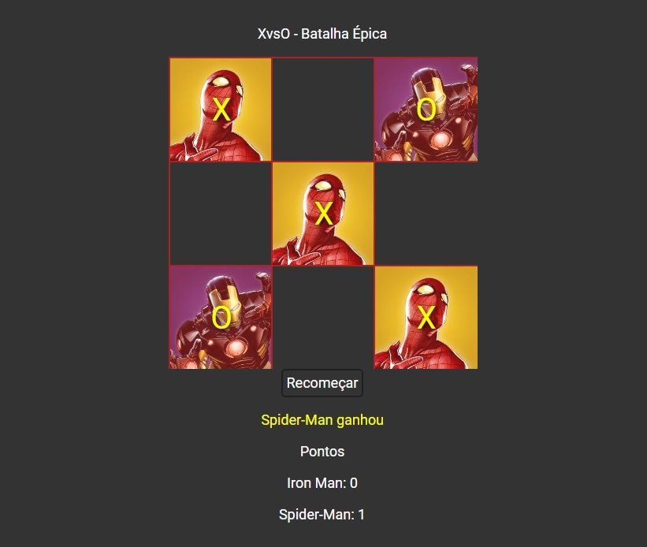

  <h1>XvsO</h1>
  
  
Continuation of epic battle between X and O using Marvel and Angular power.

  <b>Data provided by Marvel. © 2014 Marvel</b>

## How to Play

- Go to [XvsO site](https://xvso.netlify.app/)
- Type the name of your hero and his enemy
- Make your attacks through Tic Tac Toe

## License

[MIT](https://github.com/GuiDevloper/XvsO/blob/master/LICENSE)

Copyright (c) 2020 Guilherme Correia
